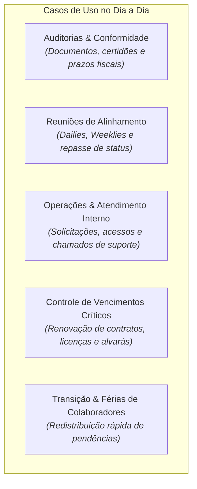
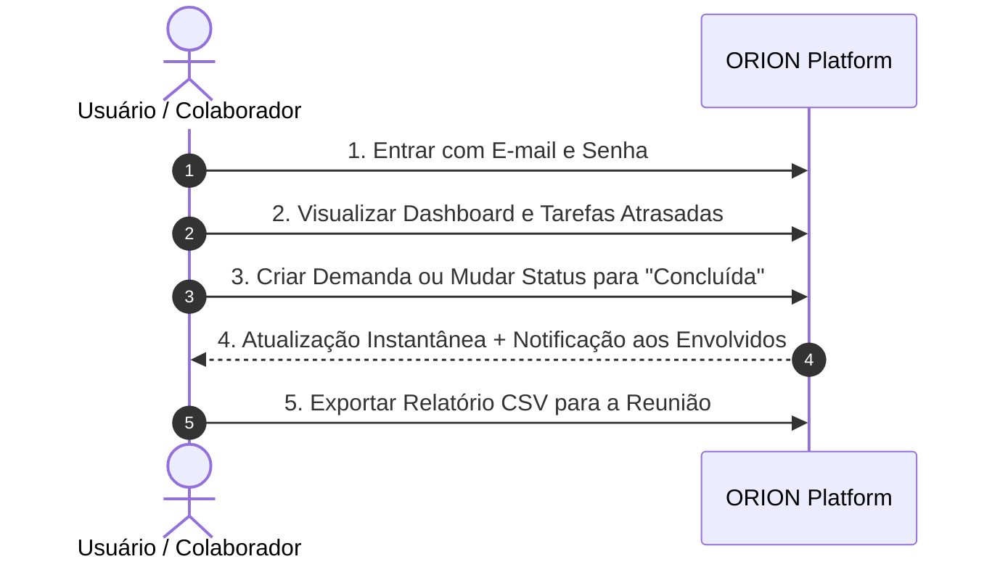

# 🚀 ORION (PolarisTasks) — Guia do Produto & Manual do Usuário

O **ORION** (PolarisTasks) é uma plataforma intuitiva e ágil criada para simplificar a gestão de demandas, prazos e entregas em equipes de qualquer segmento. 

Ele substitui controles manuais e planilhas compartilhadas que se perdem no dia a dia por um ambiente centralizado, transparente e focado no que realmente importa: **saber exatamente o que precisa ser feito, quem é o responsável e quando deve ser entregue.**

---

## 🎯 Por que o ORION existe? (O Problema que Resolvemos)

Nas rotinas corporativas, o uso de planilhas para controle de pendências costuma gerar gargalos conhecidos:
* **Falta de clareza:** Linhas apagadas sem querer, fórmulas quebradas e dados desatualizados.
* **Ambiguidade de donos:** Dificuldade em saber quem é o responsável direto por cada ação.
* **Prazos perdidos:** Atrasos só são percebidos quando o problema já aconteceu.
* **Excesso de reuniões de status:** Tempo perdido apenas para descobrir o andamento das tarefas.

O ORION elimina esses atritos com uma interface limpa, onde cada colaborador visualiza suas prioridades em segundos e os gestores acompanham a evolução dos projetos em tempo real.

---

## 💡 Principais Benefícios

| Benefício | Como o ORION entrega no seu dia a dia |
|---|---|
| **Zero Perda de Prazos** | Demandas vencidas ganham destaque visual imediato em vermelho e cards dedicados no topo da tela. |
| **Responsabilidade Clara** | Toda demanda tem um responsável nominal e um projeto vinculado. Nada fica "sem dono". |
| **Agilidade Operacional** | Atualize o status de qualquer tarefa com apenas 1 clique, sem precisar abrir modais ou recarregar a página. |
| **Alertas Automáticos** | Receba notificações instantâneas sempre que uma nova tarefa for atribuída a você ou quando seu status mudar. |
| **Relatórios em 1 Clique** | Exporte dados filtrados para Excel (CSV) a qualquer momento para reuniões de diretoria ou auditorias. |
| **Visual Flexível & Moderno** | Alterne entre o modo Tabela (alta densidade) e o modo Cards (visualização ágil), além de suporte completo a Dark Mode. |

---

## 🏢 Casos de Uso na Prática

O ORION adapta-se à dinâmica de diferentes áreas e rotinas:

### 1. Auditorias, Fechamentos e Conformidade Fiscal
* **Cenário:** A equipe precisa levantar dezenas de documentos comprobatórios (balancetes, certidões, contratos e guias de recolhimento) com prazos rígidos.
* **Como usar o ORION:**
  1. Cada pendência é cadastrada com seu código e data limite.
  2. O auditor ou gestor filtra por **Status: Atrasadas** para identificar imediatamente os gargalos.
  3. Com um clique no botão **Exportar**, gera-se a planilha oficial com a posição do dia para apresentação.

### 2. Reuniões de Alinhamento Semanal (Weekly / Daily)
* **Cenário:** O líder de equipe reúne o time para repassar as entregas da semana.
* **Como usar o ORION:**
  1. Ative a visualização em **Modo Cards**.
  2. Filtre pelo nome de cada colaborador individualmente.
  3. Conforme as entregas são confirmadas, altere o status de **Aberta** para **Em andamento** ou **Concluída** diretamente na tela.
  4. Surgiu uma nova tarefa na reunião? Clique em **Nova demanda** e atribua na hora.

### 3. Controle de Vencimento de Licenças, Certidões e Contratos
* **Cenário:** Manter a empresa em dia com licenças de software, alvarás de funcionamento e certidões negativas de débito.
* **Como usar o ORION:**
  1. Cadastre cada certidão com sua data final de validade.
  2. O painel monitora as datas e avisa visualmente com antecedência quando um prazo expira.
  3. A equipe renova os itens antes de gerar impacto jurídico ou bloqueio de faturamento.

### 4. Gestão de Ausências e Redistribuição de Trabalho
* **Cenário:** Um membro da equipe entra de férias ou sai da empresa e suas tarefas precisam ser redistribuídas.
* **Como usar o ORION:**
  1. Filtre as demandas do colaborador ausente que ainda estão com status **Aberta** ou **Em andamento**.
  2. Edite as demandas e transfira a responsabilidade para o novo encarregado.
  3. O novo responsável recebe um alerta instantâneo na sua central de notificações.

---

## 🌟 Principais Recursos da Aplicação

### 1. 📊 Painel Geral de Controle (Dashboard)
* **Contadores de Destaque:**
  * **Total de Demandas:** Volume total de tarefas cadastradas sob sua gestão.
  * **Demandas Abertas:** Itens que ainda requerem ação da equipe.
  * **Demandas Atrasadas:** Destaque de urgência. Ao clicar no card de atrasadas, a listagem aplica o filtro de pendências vencidas automaticamente.
* **Busca Global Instantânea:** Digite qualquer palavra da descrição, nome do projeto, responsável ou data para encontrar tarefas instantaneamente.
* **Filtros Combinados:** Filtre simultaneamente por Projeto, Responsável e Status.
* **Alternância de Visualização:**
  * **Modo Tabela:** Ideal para quem prefere visualização em formato de planilha tradicional, com colunas alinhadas e botões rápidos.
  * **Modo Cards:** Ideal para navegação fluida em telas menores, celulares ou dinâmicas de reuniões visuais.

### 2. 📋 Gestão Completa de Demandas
* **Cadastro Rápido:** Formulário simples para definir Descrição, Projeto, Responsável, Prazo de Entrega e Status Inicial.
* **Seletor Visual de Datas:** Calendário interativo para seleção de prazos sem erro de digitação.
* **Página de Detalhes da Demanda:**
  * Visualização ampliada com badge de urgência se o item estiver atrasado.
  * Botão de cópia rápida do código da demanda (ex: `PEN-001`) para a área de transferência.
  * Histórico com data e hora exatas de quando a demanda foi aberta e quando ocorreu a última atualização.
  * Edição integral ou exclusão da demanda.

### 3. 📁 Organização por Projetos
* **Projetos Centralizados:** Crie projetos para agrupar demandas por iniciativas, clientes, setores ou áreas temáticas.
* **Proteção de Dados:** O sistema avisa e impede a exclusão acidental de projetos que ainda possuam tarefas atreladas, garantindo que nenhum histórico se perca.

### 4. 🔔 Central de Notificações
* **Sininho Inteligente na Barra Superior:** Exibe um contador visual sempre que houver novidades direcionadas a você.
* **Alertas de Atribuição e Mudança:** Saiba na hora quando alguém passou uma tarefa para o seu nome ou concluiu uma pendência.
* **Ação Rápida:** Botão para marcar todas as notificações como lidas com um clique.

### 5. 📥 Exportação de Relatórios para Excel
* **Exportação Personalizada:** O botão **Exportar** gera um arquivo no formato `.csv` contendo exatamente os dados que estão visíveis após a aplicação dos seus filtros de busca.
* **Compatibilidade Total:** Arquivo gerado com acentuação e formatação corretas, pronto para abrir diretamente no Microsoft Excel ou Google Planilhas.

### 6. 🌓 Tema Escuro e Claro (Dark/Light Mode)
* **Conforto Visual:** Alterne entre tema claro e escuro a qualquer momento pelo botão na barra superior. O sistema memoriza sua preferência automaticamente.

---

## 📱 Guia Rápido: Como Usar o ORION no Dia a Dia

### Passo 1: Acessar a Plataforma
1. Acesse o endereço do ORION no seu navegador.
2. Digite seu **e-mail corporativo** e sua **senha**.
3. Se for seu primeiro acesso, clique em **Cadastre-se**, preencha seu nome, e-mail e crie sua senha.

### Passo 2: Criar um Projeto (se necessário)
1. No topo da tela, clique no botão **Novo projeto**.
2. Informe o nome (ex: `Fechamento Fiscal 2026` ou `Expansão de Lojas`) e uma breve descrição.
3. Clique em **Salvar**.

### Passo 3: Cadastrar uma Nova Demanda
1. Clique no botão **Nova demanda**.
2. Preencha os campos:
   * **Descrição:** O que precisa ser feito de forma clara e objetiva.
   * **Projeto:** Selecione a qual projeto a demanda pertence.
   * **Responsável:** Escolha quem executará a tarefa.
   * **Prazo:** Escolha a data limite no calendário.
   * **Status:** Deixe como "Aberta" ou "Em andamento".
3. Clique em **Salvar**. O responsável receberá um alerta automaticamente.

### Passo 4: Atualizar e Concluir Tarefas
1. Na lista de demandas, você pode mudar o status de qualquer item a qualquer momento no seletor da coluna **Status**.
2. Ao selecionar **Concluída**, a demanda é finalizada e deixa de contar nas métricas de pendências abertas ou atrasadas.

### Passo 5: Filtrar e Gerar Relatórios
1. Use a barra de busca ou os seletores de **Projeto**, **Responsável** e **Status** para isolar o que deseja acompanhar.
2. Clique em **Exportar** no canto superior direito para baixar a planilha correspondente.

---

## ⚖️ Planilha Compartilhada vs. ORION

| Situação Cotidiana | Planilha Tradicional | ORION (PolarisTasks) |
|---|---|---|
| **Saber quem é o responsável** | Nomes digitados com abreviações ou erros que dificultam filtros | Lista padronizada de usuários com login individual |
| **Identificar o que está atrasado** | Depende de fórmulas manuais que costumam quebrar | Destaque automático em vermelho e contador em tempo real |
| **Duas pessoas editando juntas** | Conflitos de salvamento, travamento e perda de dados | Acesso simultâneo fluido e seguro |
| **Saber quando algo mudou** | Ninguém é avisado a menos que alguém mande mensagem | Notificações automáticas na tela ao receber uma tarefa |
| **Prestar contas para a diretoria** | Horas limpando a planilha antes da reunião | 1 clique para exportar a posição consolidada |

---

> 💡 **Dica de Produtividade:** Comece seu dia clicando no card vermelho **Demandas Atrasadas** no topo da tela. Resolvendo os itens críticos primeiro, seu fluxo de trabalho ganha ritmo e previsibilidade.
