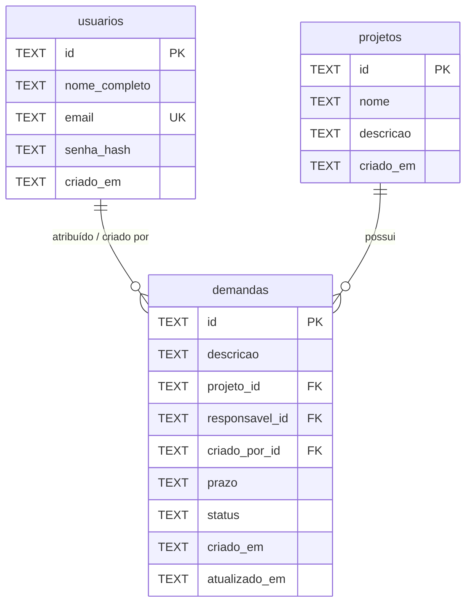

# Schema do Banco de Dados

Banco de dados relacional utilizando **SQLite** (`bun:sqlite`) com suporte a WAL (`journal_mode = WAL`) e chaves estrangeiras ativas (`foreign_keys = ON`).

---

## 🗺️ Diagrama de Relacionamentos (ERD)

---

## 📋 Tabelas

### 1. `usuarios`
Armazena os dados de autenticação e perfil dos usuários.

| Coluna | Tipo | Restrições | Descrição |
|---|---|---|---|
| `id` | `TEXT` | `PRIMARY KEY` | Identificador único |
| `nome_completo` | `TEXT` | `NOT NULL` | Nome completo do usuário |
| `email` | `TEXT` | `NOT NULL`, `UNIQUE` | E-mail para autenticação |
| `senha_hash` | `TEXT` | `NOT NULL` | Hash da senha do usuário |
| `criado_em` | `TEXT` | `NOT NULL` | Timestamp ISO 8601 da criação |

---

### 2. `projetos`
Armazena os projetos aos quais as demandas são vinculadas.

| Coluna | Tipo | Restrições | Descrição |
|---|---|---|---|
| `id` | `TEXT` | `PRIMARY KEY` | Identificador único do projeto |
| `nome` | `TEXT` | `NOT NULL` | Nome do projeto |
| `descricao` | `TEXT` | `NULLABLE` | Descrição do projeto |
| `criado_em` | `TEXT` | `NOT NULL` | Timestamp ISO 8601 da criação |

---

### 3. `demandas`
Armazena as tarefas/demandas associadas a um projeto e aos usuários.

| Coluna | Tipo | Restrições | Descrição |
|---|---|---|---|
| `id` | `TEXT` | `PRIMARY KEY` | Identificador único da demanda |
| `descricao` | `TEXT` | `NOT NULL` | Descrição da demanda |
| `projeto_id` | `TEXT` | `NOT NULL`, `FK -> projetos(id)` | ID do projeto relacionado |
| `responsavel_id` | `TEXT` | `NOT NULL`, `FK -> usuarios(id)` | ID do usuário responsável |
| `criado_por_id` | `TEXT` | `NOT NULL`, `FK -> usuarios(id)` | ID do usuário criador |
| `prazo` | `TEXT` | `NOT NULL` | Prazo limite |
| `status` | `TEXT` | `NOT NULL`, `CHECK ('aberta', 'em_andamento', 'concluida')` | Status da demanda |
| `criado_em` | `TEXT` | `NOT NULL` | Timestamp ISO 8601 da criação |
| `atualizado_em` | `TEXT` | `NOT NULL` | Timestamp ISO 8601 da última alteração |
