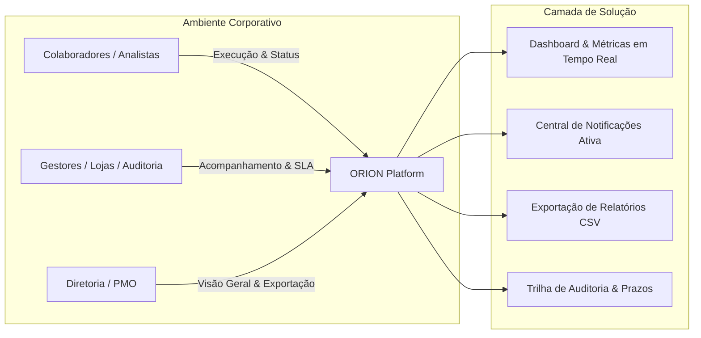
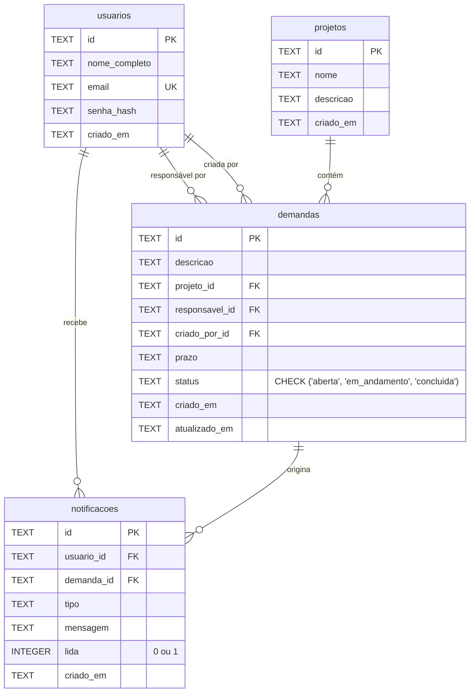
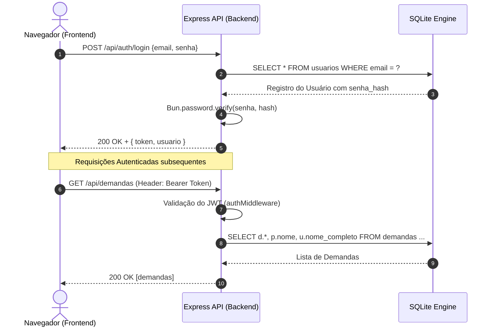
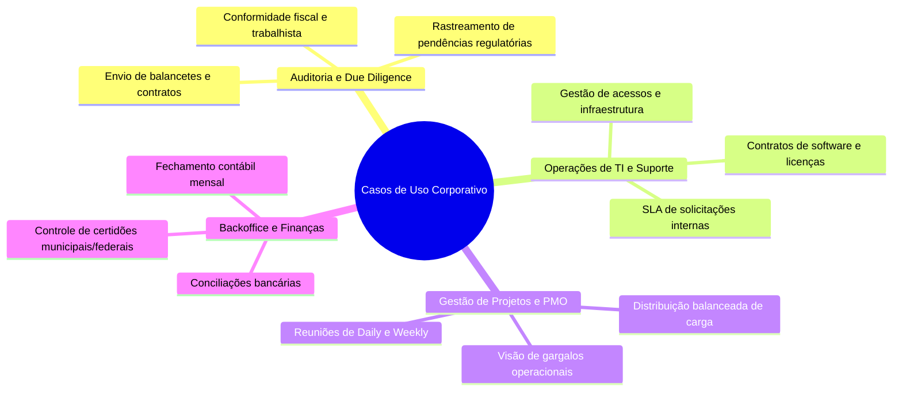

# 📘 ORION (PolarisTasks) — Documento de Produto & Especificação Corporativa

---

## Executive Summary (Resumo Executivo)

O **ORION** (também identificado na interface como **PolarisTasks**) é uma plataforma web corporativa de alta performance concebida para substituir planilhas compartilhadas e controles descentralizados de demandas, pendências e entregas em equipes multidisciplinares.

Projetado com foco em **clareza operacional, rastreabilidade e simplicidade extrema (YAGNI / Zero Bloat)**, o sistema oferece visibilidade imediata sobre o status de cada tarefa, os responsáveis diretos, os projetos vinculados e, principalmente, **os prazos críticos e itens em atraso**.



---

## 1. 🎯 Diagnóstico & Estado Atual do Projeto

### 1.1. Diagnóstico do Estado Atual
A aplicação encontra-se em estado **completamente funcional, madura, estável e pronta para execução** (produção e desenvolvimento). O projeto resolve com precisão o problema da dispersão de dados típica de planilhas Excel/Google Sheets, implementando garantias relacionais e segurança de acesso.

| Pilar | Estado Atual | Avaliação Técnica / Operacional |
|---|---|---|
| **Arquitetura Backend** | MVC em camadas estritas | Separação limpa de `Routes ➔ Controller ➔ Service ➔ Repository ➔ SQLite`. Sem decorators, sem injeção complexa, legível por qualquer nível de desenvolvedor. |
| **Banco de Dados** | SQLite nativo (`bun:sqlite`) | Alta velocidade, arquivo único, sem servidor externo, WAL mode ativo e restrições de Foreign Key e CHECK ativadas. |
| **Frontend & UX** | React 19 + Tailwind CSS v4 + Coss UI | Interface moderna, responsiva, com alternância de visualização (Lista/Tabela e Cards), modo escuro/claro nativo e micro-interações. |
| **Segurança & Sessão** | JWT + `Bun.password` | Hashes de senha robustos (Argon2id nativo do Bun), tokens assinados com 7 dias de validade e proteção de rotas client/server. |
| **Central de Alertas** | Notificações no banco + EventEmitter | Eventos síncronos persistidos no banco de dados e disparados em atribuições ou mudanças de status, com interface de dropdown e contadores de não lidas. |
| **Implantação & DevOps** | Docker Multi-Stage | Um único comando (`docker compose up --build`) compila e serve backend + frontend na porta unificada `3005`. |

---

## 2. 🏛️ Arquitetura & Especificações Técnicas

### 2.1. Stack Tecnológica

- **Runtime & Engine:** [Bun](https://bun.sh/) (v1.x) — Execução ultra-rápida de TypeScript, empacotador e runtime com suporte a SQLite nativo.
- **Backend Framework:** [Express 5](https://expressjs.com/) + TypeScript.
- **Banco de Dados:** [SQLite 3](https://sqlite.org/) via `bun:sqlite` (`PRAGMA journal_mode = WAL`, `PRAGMA foreign_keys = ON`).
- **Frontend SPA:** [React 19](https://react.dev/) + [Vite 8](https://vite.dev/) + TypeScript + [React Router DOM v7](https://reactrouter.com/).
- **Design System & Estilização:** [Tailwind CSS v4](https://tailwindcss.com/) + componentes [coss UI](https://coss.com/ui) baseados em `@base-ui/react`, `@fontsource-variable/inter` e ícones [Lucide React](https://lucide.dev/).
- **Containerização:** [Docker](https://www.docker.com/) com multi-stage build (`dev` e `prod`).

```text
bun-express-desafio-cosmos/
├── backend/
│   ├── src/
│   │   ├── auth/          # Autenticação, login, cadastro, JWT e middleware
│   │   ├── usuario/       # Entidade de usuários, repositório e serviços
│   │   ├── projeto/       # Entidade de projetos e regras de vínculo
│   │   ├── demanda/       # Entidade central de tarefas/demandas e filtros
│   │   ├── notificacao/   # Barramento de eventos e histórico de notificações
│   │   ├── database/      # Conexão SQLite (WAL), DDL e script de seed
│   │   ├── http-error.ts  # Erros HTTP customizados tipados
│   │   └── server.ts      # Servidor Express, API REST e integração SPA/Vite
│   └── package.json
├── frontend/
│   ├── src/
│   │   ├── components/    # Navbar, selects, diálogos e componentes UI Coss
│   │   ├── lib/           # Cliente HTTP api.ts, auth.ts, utilitários e status
│   │   ├── pages/         # Login, Cadastro, Dashboard e DetalhesDemanda
│   │   ├── App.tsx        # Definição de rotas públicas e privadas
│   │   └── main.tsx       # Bootstrap da aplicação React
│   └── package.json
├── Dockerfile             # Multi-stage build (dev / prod)
├── docker-compose.yml     # Orquestração para produção
├── docker-compose.dev.yml # Orquestração com hot-reload (volume mount)
└── PRODUCT.md             # Este documento
```

---

## 3. 🗄️ Modelo de Dados & Integridade Relacional

O modelo relacional foi desenhado para garantir que nenhuma demanda fique órfã ou com dados inconsistentes.



### 3.1. Dicionário de Entidades

#### Tabela `usuarios`
| Campo | Tipo | Nulo | Descrição |
|---|---|---|---|
| `id` | `TEXT` | Não (PK) | Identificador textual / UUID único |
| `nome_completo` | `TEXT` | Não | Nome legível do usuário para exibição em dashboards |
| `email` | `TEXT` | Não (UK) | E-mail corporativo único utilizado no login |
| `senha_hash` | `TEXT` | Não | Hash criptográfico via `Bun.password.hash` (Argon2id) |
| `criado_em` | `TEXT` | Não | Timestamp ISO 8601 de criação da conta |

#### Tabela `projetos`
| Campo | Tipo | Nulo | Descrição |
|---|---|---|---|
| `id` | `TEXT` | Não (PK) | Identificador textual / UUID único |
| `nome` | `TEXT` | Não | Nome do projeto ou iniciativa corporativa |
| `descricao` | `TEXT` | Sim | Escopo detalhado ou observações do projeto |
| `criado_em` | `TEXT` | Não | Timestamp ISO 8601 de criação |

#### Tabela `demandas`
| Campo | Tipo | Nulo | Descrição |
|---|---|---|---|
| `id` | `TEXT` | Não (PK) | Identificador da pendência (ex: `PEN-001` ou UUID) |
| `descricao` | `TEXT` | Não | Detalhamento da ação a ser executada |
| `projeto_id` | `TEXT` | Não (FK) | Vínculo obrigatório com `projetos(id)` |
| `responsavel_id` | `TEXT` | Não (FK) | Usuário encarregado da entrega (`usuarios.id`) |
| `criado_por_id` | `TEXT` | Não (FK) | Usuário autenticado que cadastrou a demanda |
| `prazo` | `TEXT` | Não | Data limite no formato `YYYY-MM-DD` |
| `status` | `TEXT` | Não | Restrição CHECK: `'aberta'`, `'em_andamento'`, `'concluida'` |
| `criado_em` | `TEXT` | Não | Timestamp ISO 8601 de abertura |
| `atualizado_em` | `TEXT` | Não | Timestamp ISO 8601 da última alteração de dados/status |

#### Tabela `notificacoes`
| Campo | Tipo | Nulo | Descrição |
|---|---|---|---|
| `id` | `TEXT` | Não (PK) | Identificador UUID da notificação |
| `usuario_id` | `TEXT` | Não (FK) | Destinatário do alerta com `ON DELETE CASCADE` |
| `demanda_id` | `TEXT` | Sim (FK) | Demanda relacionada com `ON DELETE CASCADE` |
| `tipo` | `TEXT` | Não | Categoria do evento (`demanda_criada`, `demanda_status_alterado`) |
| `mensagem` | `TEXT` | Não | Texto descritivo entregue ao usuário |
| `lida` | `INTEGER` | Não | Flag booleana (`0` para não lida, `1` para lida) |
| `criado_em` | `TEXT` | Não | Timestamp ISO 8601 do disparo do alerta |

---

## 4. 🌐 Catálogo de Endpoints da API REST

Todas as rotas sob `/api/*` (exceto `/api/auth/*`) exigem o header HTTP `Authorization: Bearer <token_jwt>`.



### 4.1. Módulo de Autenticação (`/api/auth`)
- `POST /api/auth/cadastro` — Registra novo usuário corporativo e retorna token JWT + dados públicos.
- `POST /api/auth/login` — Autentica e-mail/senha e emite token JWT com validade de 7 dias.

### 4.2. Módulo de Usuários (`/api/usuarios`)
- `GET /api/usuarios` — Lista todos os usuários cadastrados (id, nome e e-mail) para preenchimento de seletores e filtros.

### 4.3. Módulo de Projetos (`/api/projetos`)
- `GET /api/projetos` — Lista todos os projetos ordenados por data de criação.
- `POST /api/projetos` — Cria um novo projeto (`nome`, `descricao` opcional).
- `PUT /api/projetos/:id` — Atualiza o nome ou descrição de um projeto existente.
- `DELETE /api/projetos/:id` — Exclui um projeto **apenas se não houver demandas vinculadas** (integridade relacional garantida).

### 4.4. Módulo de Demandas (`/api/demandas`)
- `GET /api/demandas` — Retorna demandas com joins de Projeto e Responsável. Suporta query parameters:
  - `responsavel_id=<id>`: Filtra por colaborador.
  - `projeto_id=<id>`: Filtra por projeto.
  - `status=<aberta|em_andamento|concluida|atrasadas>`: Filtra por estágio ou atraso dinâmico.
- `GET /api/demandas/:id` — Retorna detalhes completos de uma demanda específica.
- `POST /api/demandas` — Cria uma nova demanda, preenche automaticamente `criado_por_id` e emite notificação ao responsável.
- `PUT /api/demandas/:id` — Edição integral (descrição, projeto, responsável, prazo e status) com notificação de transferência/alteração.
- `PATCH /api/demandas/:id/status` — Atualização ágil de status com disparo de notificação aos envolvidos.
- `DELETE /api/demandas/:id` — Exclusão definitiva de uma demanda.

### 4.5. Módulo de Notificações (`/api/notificacoes`)
- `GET /api/notificacoes` — Lista as notificações do usuário logado ordenadas cronologicamente.
- `PATCH /api/notificacoes/ler-todas` — Marca todas as notificações do usuário como lidas.
- `PATCH /api/notificacoes/:id/lida` — Marca uma notificação individual como lida.

---

## 5. 💻 Recursos & Funcionalidades da Plataforma

### 5.1. Dashboard Executivo & Operacional
1. **Cards Analíticos de SLA:**
   - **Total de Demandas:** Volume total sob gestão.
   - **Demandas Abertas:** Itens não concluídos no pipeline.
   - **Demandas Atrasadas:** Destaque para tarefas cujo prazo expirou (`prazo < hoje` e `status != 'concluida'`). Ao clicar no card, a lista aplica o filtro de atrasadas instantaneamente.
2. **Barra de Ferramentas e Filtros Combináveis:**
   - Filtro simultâneo por **Projeto**, **Responsável** e **Status**.
   - **Busca Global em Tempo Real:** Filtra localmente por palavras-chave na descrição, nome do projeto, responsável ou datas em múltiplos formatos (`DD/MM/AAAA` ou `AAAA-MM-DD`).
3. **Modos de Exibição Dinâmicos:**
   - **Modo Tabela (Desktop):** Visualização densa, com tooltips em descrições longas, badges de status coloridos e seletores rápidos in-line para mudança de status sem abrir popups.
   - **Modo Cards / Grade (Responsivo):** Ideal para visualização rápida em dispositivos móveis ou reuniões de equipe, com cards informativos e elevação interativa.
4. **Paginação Integrada:** Controle de fluxo configurado para 10 itens por página, garantindo carregamento instantâneo da interface.
5. **Exportação de Relatórios em CSV:**
   - Geração client-side imediata de arquivo `.csv` respeitando todos os filtros ativos, com codificação UTF-8 com BOM (compatibilidade nativa com Microsoft Excel sem problemas de acentuação).

### 5.2. Gestão de Projetos e Demandas
- **Criação e Gestão Rápida:** Modais intuitivos para cadastro de projetos e demandas com validação de campos obrigatórios.
- **Seletor de Data Acessível (`DatePicker`):** Componente de calendário visual para escolha precisa do prazo limite.
- **Proteção Relacional de Projetos:** O sistema impede a exclusão acidental de projetos que possuam demandas em andamento, exibindo mensagem clara sobre o número de pendências atreladas.

### 5.3. Página Dedicada de Detalhes da Demanda (`/demandas/:id`)
- **Visualização Aprofundada:** Exibe o ID do registro com botão de cópia com 1 clique para a área de transferência.
- **Destaque Visual de Criticidade:** Se a demanda estiver vencida, o card principal adota borda e fundo em tom de alerta com badge "Atrasada".
- **Metadados de Auditoria:** Apresenta data e hora exatas de criação e da última atualização no formato brasileiro.
- **Navegação Contextual:** Breadcrumbs navegáveis (`Dashboard > Demandas > Nome do Projeto`).

### 5.4. Central de Notificações
- **Feedback em Tempo Real:** Sempre que uma tarefa é atribuída a um colaborador ou tem seu status modificado, os interessados recebem alertas no dropdown da Navbar.
- **Contador com Badge Pulsante:** Identificação visual de alertas pendentes.
- **Ação Rápida "Ler Todas":** Permite limpar as notificações pendentes com um único clique.

### 5.5. Personalização Visual & Acessibilidade
- **Dark Mode / Light Mode:** Alternância imediata com persistência em `localStorage` e respeito automático às preferências de sistema do usuário (`prefers-color-scheme`).
- **Design System Coss UI:** Componentes com tipografia Inter, contraste refinado e foco em acessibilidade.

---

## 6. 🏢 Casos de Uso no Dia-a-Dia Corporativo

O ORION foi desenhado para atuar em diversos cenários empresariais críticos onde planilhas falham.



### Caso de Uso 1: Auditoria Contábil, Fiscal & Due Diligence
- **Cenário:** Em processos de auditoria (como exemplificado no seed de dados da Cosmos), uma equipe multidisciplinar precisa recolher dezenas de documentos comprobatórios (balancetes, cópias de contratos sociais, comprovantes de FGTS, conciliação de estoques).
- **Problema da Planilha:** Múltiplas pessoas editam ao mesmo tempo, linhas são apagadas acidentalmente, status são preenchidos com grafias divergentes ("ok", "feito", "Concluído", "SIM"), e não há clareza de quem é o dono de cada pendência.
- **Solução no ORION:**
  1. Cada pendência é cadastrada com ID único (`PEN-001`, `PEN-002`), projeto (`Projeto Aurora`, `Projeto Bandeirante`) e responsável nominal.
  2. O auditor filtra por `Status: Atrasadas` para saber exatamente quais documentos estão bloqueando o relatório final.
  3. Com um clique em **Exportar CSV**, gera-se a evidência formal para a reunião de prestação de contas.

### Caso de Uso 2: Reuniões Semanais de Status (Weekly / Daily Meetings)
- **Cenário:** O gestor da área reúne a equipe para repassar o fluxo de trabalho da semana.
- **Execução no ORION:**
  1. O gestor abre o painel e seleciona o **Modo Cards**.
  2. Filtra por colaborador (`Responsável: Beatriz Nogueira`) para fazer a passagem individual de tarefas.
  3. À medida que os tópicos são repassados, o status é alterado diretamente na lista (`Aberta` ➔ `Em andamento` ➔ `Concluída`), sem recarregar a página.
  4. Caso surja uma nova demanda na reunião, o botão **Nova demanda** permite o registro imediato com atribuição na hora.

### Caso de Uso 3: Controle de Vencimento de Licenças, Certidões & Contratos
- **Cenário:** A área de compras e compliance necessita monitorar a renovação periódica de certidões negativas de débito (CNDs), licenças de software e apólices de seguro.
- **Execução no ORION:**
  1. Cada certidão ou licença é registrada como demanda, vinculando o prazo final de validade.
  2. O painel destaca em vermelho todas as demandas que atingiram a data limite sem conclusão.
  3. A equipe atua proativamente antes da perda de regularidade jurídica ou interrupção de serviços.

### Caso de Uso 4: Onboarding e Redistribuição de Carga de Trabalho
- **Cenário:** Um colaborador entra de férias ou uma nova pessoa ingressa no time e precisa assumir tarefas em andamento.
- **Execução no ORION:**
  1. O gestor filtra todas as tarefas do colaborador ausente (`Responsável: Rafael Duarte` + `Status: Aberta`).
  2. Abre a edição de cada demanda e altera o responsável para o novo encarregado (`Fernanda Lima`).
  3. O sistema gera automaticamente uma notificação para Fernanda: *"Demanda X atribuída a você"*, garantindo transição transparente de responsabilidades.

---

## 7. ⚖️ Matriz Comparativa: Planilhas vs. ORION

| Critério de Comparação | Planilha Compartilhada (Excel / Sheets) | ORION (PolarisTasks) |
|---|---|---|
| **Integridade de Dados** | ❌ Células apagadas por engano, fórmulas quebradas, status inconsistentes |  Restrições `CHECK`, chaves estrangeiras obrigatórias e tipos estritos |
| **Visibilidade de Atrasos** | ❌ Requer formatação condicional manual que frequentemente é desconfigurada |  Cálculo dinâmico em tempo real com destaque visual e cards dedicados |
| **Responsabilização** | ❌ Nomes preenchidos de forma ambígua (ex: "Ana", "A. Paula", "Ana Paula") |  Entidade de usuários padronizada com vínculo estrito e login pessoal |
| **Auditoria e Segurança** | ❌ Qualquer pessoa com o link pode alterar tudo sem rastro |  Autenticação JWT, senhas criptografadas e campos de `criado_por` e datas |
| **Notificações de Ação** | ❌ Não há alertas nativos sobre quem deve fazer o quê |  Notificações em tempo real sobre atribuições e alterações de status |
| **Performance e Acesso** | ❌ Lentidão ao crescer o número de linhas e conflitos de edição simultânea |  Engine SQLite em modo WAL com respostas em milissegundos e concorrência limpa |

---

## 8. 🚀 Como Operar e Implantar o Sistema

### 8.1. Execução Rápida via Docker (Produção)
Para subir todo o ambiente (backend Express, frontend React compilado e banco SQLite pré-populado com seed) em 1 único comando:

```bash
docker compose up --build
```
> Acesse: **[http://localhost:3005](http://localhost:3005)**

### 8.2. Execução para Desenvolvimento (com Hot-Reload)
```bash
# Via Docker Dev (Vite integrado ao Express com hot-reload)
docker compose -f docker-compose.yml -f docker-compose.dev.yml up --build

# Ou Localmente com Bun (sem Docker)
cd backend && bun install && cd ..
cd frontend && bun install && cd ..
bun run dev
```

### 8.3. Credenciais de Acesso Disponíveis no Seed
Caso o banco seja iniciado do zero, o sistema popula automaticamente os usuários com a senha padrão `novo123456789`:
- `ana.paula.ribeiro@cosmos.com`
- `beatriz.nogueira@cosmos.com`
- `carlos.menezes@cosmos.com`
- `fernanda.lima@cosmos.com`
- `juliana.castro@cosmos.com`
- `marcos.vinicius.alves@cosmos.com`
- `rafael.duarte@cosmos.com`

---

## 9. 🔮 Roadmap & Sugestões de Evolução Futura

Para organizações que desejam expandir o ORION mantendo a filosofia de simplicidade e baixo custo de manutenção, os seguintes incrementos são arquiteturalmente recomendados:

1. **Notificações Push / WebSockets (SSE):**
   - Conectar o barramento nativo `notificacaoEvents` (já implementado no backend) a um endpoint de *Server-Sent Events* (SSE) para atualização instantânea do badge sem necessidade de polling a cada 30 segundos.
2. **Histórico de Alterações / Trilha de Auditoria Detalhada:**
   - Criação de uma tabela `demandas_historico` para registrar quem alterou o prazo ou a descrição e quando, possibilitando auditoria forense de mudanças.
3. **Classificação por Tags / Criticidade:**
   - Adição opcional de tag de prioridade (`baixa`, `media`, `alta`, `critica`) para refinar a ordenação das demandas no painel.
4. **Relatórios Gerenciais em PDF:**
   - Exportação de relatório consolidado por projeto contendo gráficos de distribuição de status e taxa de entrega no prazo.

---

> **ORION (PolarisTasks)** — *Construído para entregar clareza, velocidade e controle operacional sem a complexidade desnecessária de softwares corporativos pesados.*
