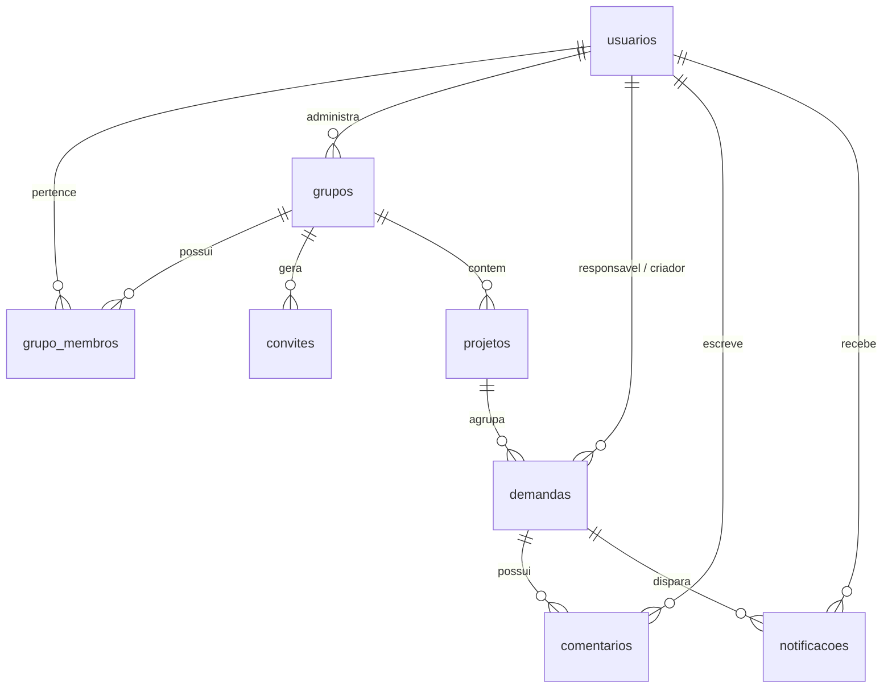

# ORION — Sistema de Gestão e Controle de Demandas

[](https://github.com/Kazbonfim2/bun-task-manager-cosmos-project/actions/workflows/ci.yml)


Aplicação web fullstack de alta performance desenvolvida para centralizar o gerenciamento de demandas, projetos, prazos e equipes, substituindo planilhas compartilhadas por fluxos estruturados com notificações, menções e controle de atrasos em tempo real.

---

## ⚡ Início Rápido (Quickstart)

### Opção 1: Via Docker (Recomendado)
```bash
docker compose up --build
```
> Acesse: **[http://localhost:3005](http://localhost:3005)**

### Opção 2: Local com Bun
```bash
bun run setup    # Instala dependências da raiz, backend e frontend
bun run dev      # Executa backend e frontend integrados com hot-reload
```
> Acesse: **[http://localhost:3005](http://localhost:3005)**

### 🧪 Testes e Qualidade
```bash
bun run test     # Executa a suíte de testes unitários e de integração
```

#### 🌱 Credenciais e Seed Inicial
O banco é populado automaticamente na primeira execução com usuários de exemplo no padrão `nome.sobrenome@cosmos.com` (ex: `ana.paula.ribeiro@cosmos.com`) e senha padrão `novo123456789`.

---

## 🏛️ Arquitetura & Visão Técnica

O projeto é estruturado em monorepo enxuto com integração direta entre Express 5 e Vite middleware durante o desenvolvimento, e SPA estático servido pelo Express em produção.

```text
├── backend/
│   └── src/
│       ├── auth/          # Autenticação JWT, login, cadastro e recuperação por pergunta secreta
│       ├── grupo/         # Multi-tenancy, membros de equipe e convites descartáveis (ORION-XXXX-XXXX)
│       ├── usuario/       # Gestão de membros, perfil e alteração de credenciais
│       ├── projeto/       # CRUD de projetos vinculados ao grupo ativo
│       ├── demanda/       # Regras de demandas, status, prazos e varredura de atrasos
│       ├── comentario/    # Comentários em demandas e suporte a menções
│       ├── notificacao/   # Central de eventos, marcação de lidas e alertas automáticos
│       ├── database/      # Conexão libSQL (SQLite local / Turso Cloud) e migrações
│       ├── http-error.ts  # Tratamento unificado de erros HTTP
│       └── server.ts      # Ponto de entrada Express 5, rotas /api e Vite SSR/middleware
├── frontend/
│   └── src/
│       ├── components/    # Componentes modais, navbar, textarea com menções e UI primitives
│       ├── pages/
│       │   ├── Dashboard/        # Visão geral, métricas, filtros combinados, visualização cards/tabela
│       │   ├── DetalhesDemanda/  # Linha do tempo, histórico, comentários e menções @usuario
│       │   ├── Configuracoes/    # Perfil, alteração de senha e pergunta secreta
│       │   ├── Login/ e Cadastro/# Fluxos de autenticação e validação de convites
│       │   └── RecuperarSenha/   # Redefinição de senha sem dependência de SMTP
│       ├── hooks/         # Hooks customizados (cache, sincronização)
│       ├── lib/           # Cliente HTTP (api.ts), sessão e utilitários
│       └── index.css      # Design System em Tailwind CSS v4 com variáveis de tema claro e escuro
└── docker-compose.yml     # Orquestração de containers para produção e desenvolvimento
```

---

## 🗄️ Modelo de Dados & Esquema (libSQL / SQLite)

O banco de dados utiliza `@libsql/client` suportando SQLite local com modo `WAL` (`journal_mode = WAL`) ou banco distribuído no [Turso](https://turso.tech/).



### Entidades Principais

| Tabela | Colunas Chave | Descrição / Regras |
|---|---|---|
| `usuarios` | `id`, `nome_completo`, `email`, `senha_hash`, `pergunta_secreta`, `resposta_secreta_hash` | Contas de usuário; senha com `Bun.password` e recuperação via hash da resposta. |
| `grupos` | `id`, `nome`, `dono_id`, `criado_em` | Equipes/Workspaces isolados. |
| `grupo_membros` | `grupo_id`, `usuario_id`, `criado_em` | Relação N:N de participação dos usuários nas equipes. |
| `convites` | `id`, `grupo_id`, `codigo`, `criado_por_id`, `usado_por_id`, `usado_em` | Códigos únicos (`ORION-XXXX-XXXX`) de uso único para entrada de membros. |
| `projetos` | `id`, `nome`, `descricao`, `grupo_id`, `criado_em` | Categorias de demandas restritas ao grupo. |
| `demandas` | `id`, `titulo`, `descricao`, `projeto_id`, `responsavel_id`, `criado_por_id`, `prazo`, `status`, `atraso_notificado_em` | Demandas com status (`aberta`, `em_andamento`, `concluida`). |
| `comentarios` | `id`, `demanda_id`, `usuario_id`, `texto`, `criado_em`, `atualizado_em` | Mensagens na timeline da demanda; suporta detecção de `@usuario`. |
| `notificacoes` | `id`, `usuario_id`, `demanda_id`, `tipo`, `mensagem`, `lida`, `criado_em` | Alertas de atribuição, menção, atraso e mudança de status. |

---

## 📡 Referência da API REST (`/api/*`)

Todas as rotas (exceto públicas de auth e validação de convite) exigem o cabeçalho `Authorization: Bearer <token_jwt>`.

### Autenticação (`/api/auth`)
- `POST /api/auth/cadastro` — Cadastro de usuário (suporta código de convite opcional).
- `POST /api/auth/login` — Autenticação via e-mail e senha.
- `POST /api/auth/recuperar-pergunta` — Retorna a pergunta secreta cadastrada para um e-mail.
- `POST /api/auth/validar-resposta` — Valida a resposta secreta e retorna token temporário de redefinição.
- `POST /api/auth/redefinir-senha` — Altera a senha utilizando o token de recuperação.

### Grupos & Equipes (`/api/grupos`)
- `GET /api/grupos/convites/validar/:codigo` — *(Público)* Valida status e existência de um código de convite.
- `GET /api/grupos` — Lista os grupos dos quais o usuário autenticado participa.
- `POST /api/grupos` — Cria um novo grupo (o criador torna-se o dono).
- `POST /api/grupos/convites/aceitar` — Vincula o usuário ao grupo via código de convite.
- `GET /api/grupos/:id` — Detalhes do grupo.
- `GET /api/grupos/:id/membros` — Lista membros participantes do grupo.
- `GET /api/grupos/:id/convites` — Lista códigos de convite disponíveis para o grupo (apenas dono).
- `DELETE /api/grupos/:id/membros/:usuarioId` — Remove um membro da equipe.
- `DELETE /api/grupos/:id` — Exclui o grupo (apenas dono).

### Usuários & Perfil (`/api/usuarios`)
- `GET /api/usuarios` — Lista membros para atribuição e autocomplete de menções (`@`).
- `PUT /api/usuarios/perfil` — Atualiza nome completo e/ou pergunta/resposta secreta.
- `PUT /api/usuarios/senha` — Altera a senha do usuário logado mediante validação da senha atual.

### Projetos (`/api/projetos`)
- `GET /api/projetos?grupo_id=<id>` — Lista projetos pertencentes a um grupo.
- `POST /api/projetos` — Cria um novo projeto.
- `PUT /api/projetos/:id` — Atualiza título e descrição do projeto.
- `DELETE /api/projetos/:id` — Remove um projeto e desassocia demandas.

### Demandas (`/api/demandas`)
- `GET /api/demandas?grupo_id=<id>&projeto_id=<id>&responsavel_id=<id>&status=<status>&busca=<termo>` — Listagem com filtros compostos.
- `POST /api/demandas` — Criação de demanda e notificação automática do responsável.
- `GET /api/demandas/:id` — Detalhes completos da demanda com criador e responsável.
- `PUT /api/demandas/:id` — Atualização de dados da demanda (título, descrição, prazo, responsável).
- `PATCH /api/demandas/:id/status` — Transição de status (`aberta` | `em_andamento` | `concluida`).
- `DELETE /api/demandas/:id` — Exclusão da demanda e seus comentários.

### Comentários & Menções (`/api/comentarios` e `/api/demandas/:id/comentarios`)
- `GET /api/demandas/:id/comentarios` — Lista linha do tempo de comentários da demanda.
- `POST /api/demandas/:id/comentarios` — Adiciona comentário; dispara notificações para mencionados (`@usuario`).
- `PUT /api/comentarios/:id` — Edita comentário existente (apenas autor).
- `DELETE /api/comentarios/:id` — Remove comentário (apenas autor).

### Notificações (`/api/notificacoes`)
- `GET /api/notificacoes` — Lista as notificações recentes do usuário logado.
- `PATCH /api/notificacoes/ler-todas` — Marca todas as notificações como lidas.
- `PATCH /api/notificacoes/:id/lida` — Marca uma notificação individual como lida.

---

## 🎨 Design System & Temas (Tailwind CSS v4)

O layout utiliza Tailwind CSS v4 com tokens centralizados no arquivo [frontend/src/index.css](file:///frontend/src/index.css):

- **Tema Claro (`:root`):** Paleta editorial quente com fundo `#f8f7f4`, superfícies `#ffffff` e tipografia de alto contraste `#1e1d1a`.
- **Tema Escuro (`.dark`):** Modo de baixa luminosidade com fundo `#0d0e11`, cartões escuros e contraste refinado.
- **Transições e Variáveis:** O controle de bordas (`--border`), inputs (`--input`), anéis de foco (`--ring`) e gráficos (`--chart-1` a `--chart-5`) é 100% derivado das variáveis CSS.

---

## ⚙️ Variáveis de Ambiente (`.env`)

```env
# Porta da aplicação unificada
PORT=3005

# Ambiente de execução ('development' ativa Vite HMR; 'production' serve build estático)
NODE_ENV=development

# 1. Banco de Dados Local (Padrão SQLite)
SQLITE_PATH=./data/orion.db

# 2. Banco de Dados em Nuvem (Opcional - Turso / libSQL)
# TURSO_DATABASE_URL=libsql://orion-db-org.turso.io
# TURSO_AUTH_TOKEN=seu_token_gerado_no_turso

# Chave secreta para assinatura dos tokens JWT
JWT_SECRET=orion_secret_key_change_in_production
```

---

## 🤖 Regras & Convenções de Engenharia (Para Desenvolvedores e IAs)

1. **Simplicidade Radical (YAGNI & Ponytail):** Priorize código direto, funções nativas de plataforma e o menor número de camadas possível. Evite abstrações especulativas (como factories para uma única classe ou wrappers desnecessários).
2. **Erros HTTP:** Lance sempre instâncias de `HttpError(status, message)` nos services/controllers do backend para capturas padronizadas no middleware global.
3. **Senhas & Hashes:** Utilize `Bun.password.hash()` e `Bun.password.verify()` nativos do runtime para máxima segurança sem dependências nativas C/C++ pesadas.
4. **Isolamento de Grupos:** Toda consulta a projetos ou demandas deve respeitar o `grupo_id` ativo para garantir o isolamento entre equipes.
5. **Varredura de Atrasos:** Demandas com prazo vencido e status diferente de `concluida` são processadas periodicamente pelo worker interno `varrerAtrasadas()`.
